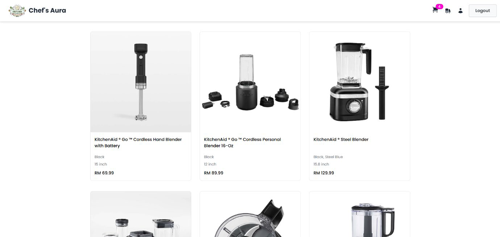
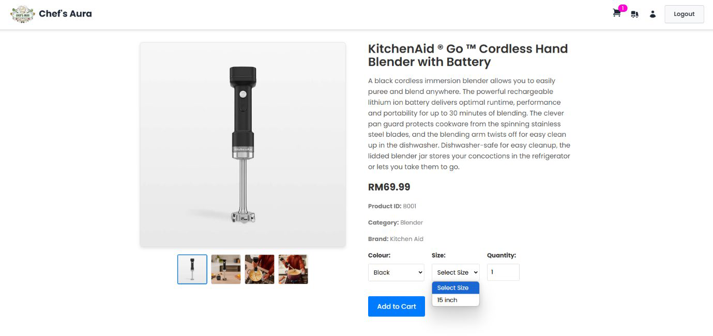
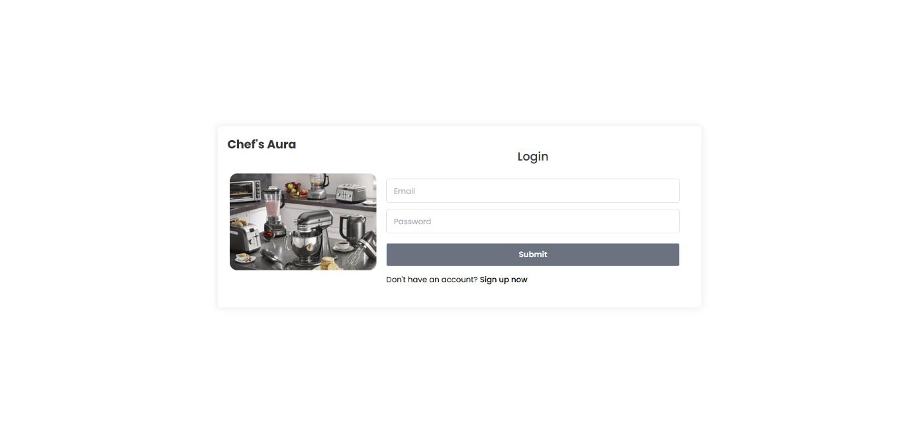
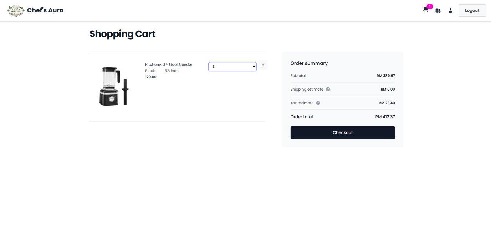
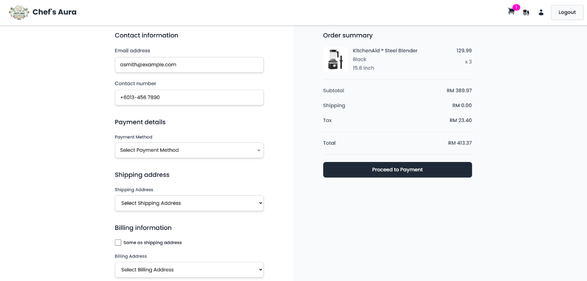
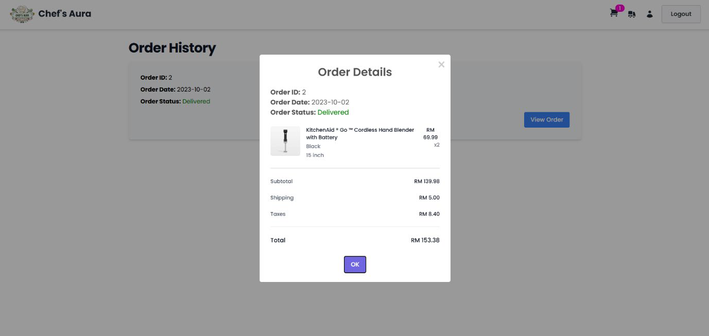
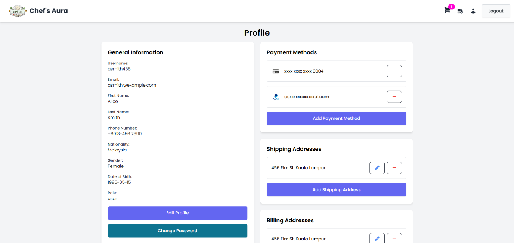
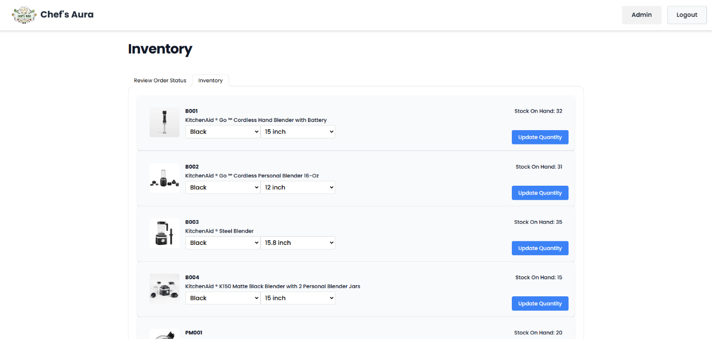

# 🛒 Chef’s Aura – Kitchen Appliances E-Commerce Platform

An e-commerce web application built for kitchen enthusiasts, offering a wide range of high-quality appliances like blenders, mixers, and food processors. Users can browse, shop, manage orders, and track deliveries, while admins handle inventory and order management seamlessly.

- **GitHub Repo:** [Chef’s Aura GitHub](https://github.com/WenHao1223/cat201-proj)

## 👥 Team Members
1. Lim Wen Hao
2. Lim Cong Sheng
3. Tan Jun Cheng
4. Teh Juin Ewe

## Project Overview
This repository contains the source code for the ChefsAura application, including both the frontend and backend components.

## 🌟 Features
### 👤 User Features
- Sign Up / Login / Logout
- Profile management (password, contact, address)
- Add/remove payment methods
- Browse product catalog
- Add to cart, checkout with tax & shipping calculations
- View order history and cancel orders

### 📦 Product Features
- Real-time stock availability
- Detailed product page with variant selections (size, colour)
- Category and brand classification

### 🛍️ Cart & Checkout
- Auto-calculated tax and free shipping logic
- Save shipping/billing address
- Payment simulation via card or PayPal option

### 🛠️ Admin Features
- View, confirm, and update customer orders
- Add stock for specific product variants
- Access all customer and inventory data

## 💻 Tech Stack
| **Layer** | **Technology** |
|----|----|
| Frontend | React, Vite, Tailwind CSS, DaisyUI, Heroicons |
| Backend | Java Servlets, Maven, Tomcat 7 |
| Data Storage | JSON files |
| Languages | TypeScript, JSX, Java, HTML, CSS |


## 📁 Project Structure
```bash
cat201-proj/
├── frontend/         # React + Vite frontend
├── backend/          # Java Servlet backend
├── userData.json     # User account and orders
├── productData.json  # Product listings and stock
```

## 📸 Screenshots
- 🏠 Home Page

- 🛍️ Product Page

- 🔐 Login & Sign Up


- 🛒 Cart Page

- 💳 Checkout Page

- 📦 Order History

- 👤 Profile Page

- 🧑‍💼 Admin Dashboard



## Notes

- Ensure that you have the required prerequisites installed for both the frontend and backend before setting up the project.
- Follow the setup instructions in the respective README files for the frontend and backend to get the project running.

## Data Parsing

The data parsing in this project is handled as follows:

1. **Backend**: The backend receives raw data from various sources (e.g., user input, external APIs) and processes it using Java Servlets. The data is validated, transformed, and stored in the database.

```bash
git clone https://github.com/WenHao1223/cat201-proj.git
cd cat201-proj/backend
mvn install
mvn tomcat7:run

```

2. **Frontend**: The frontend, built with Node.js and Vite+React, fetches data from the backend using RESTful APIs. The data is then parsed and displayed in the user interface using React components. The frontend also handles user input and sends it back to the backend for processing.

```bash
git clone https://github.com/WenHao1223/cat201-proj.git
cd cat201-proj/frontend
npm install
npm run dev
```

This ensures that the data is consistently processed and displayed across the application.

## What are RESTful APIs?

RESTful APIs (Representational State Transfer) are a type of web service that follows the principles of REST architecture. They use standard HTTP methods (GET, POST, PUT, DELETE) to perform operations on resources, which are identified by URLs. RESTful APIs are stateless, meaning each request from a client to a server must contain all the information needed to understand and process the request. This makes them scalable and easy to maintain.
